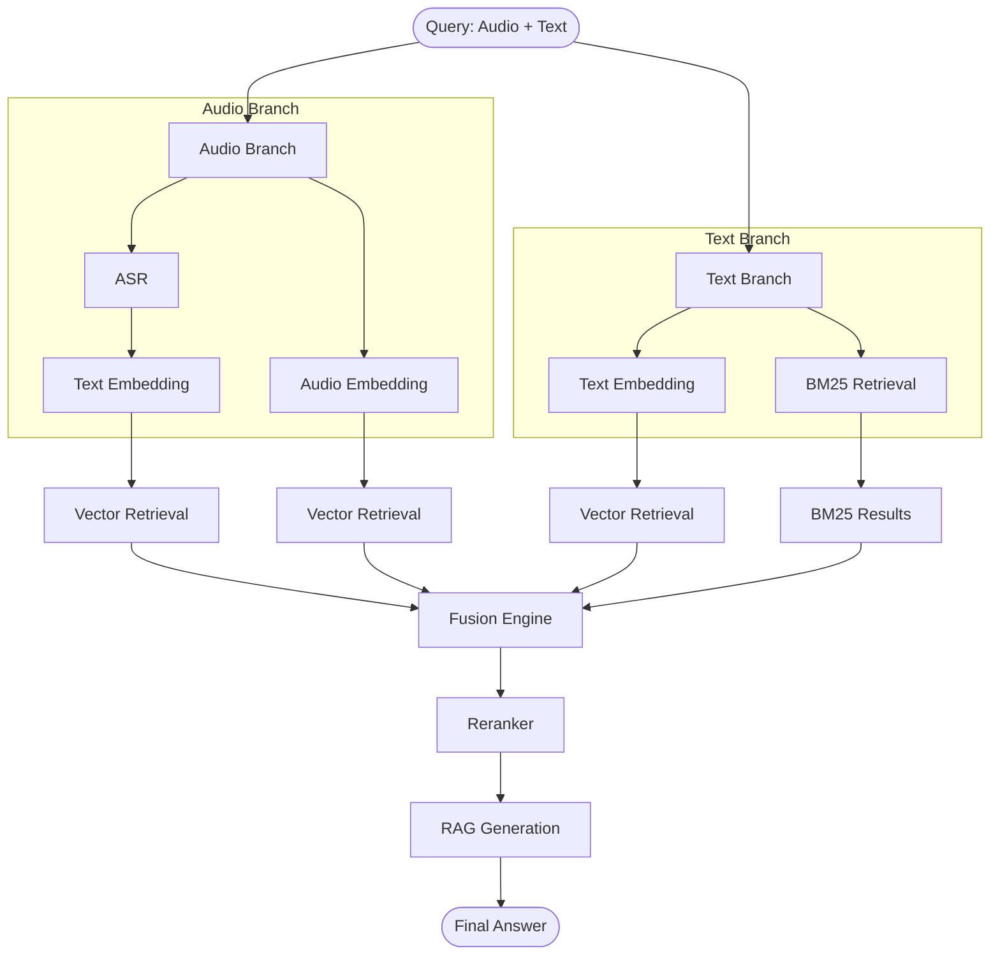

I've updated the cache architecture to match your specific stack: **SQLite for L1 metadata (path storage)** and **local disk for L2 artifact storage**. Below is the full revised architecture design document.

---

# 📄 Multimodal RAG Experimentation Platform – Architecture Design

## 1. 🎯 System Purpose

The system is a research and experimentation platform enabling:

- **Model Comparison** – ASR (speech‑to‑text), text embedding, audio embedding, reranking, and LLM generation.
- **Strategy Testing** – Vector retrieval, hybrid (BM25 + vector), fusion methods (RRF, weighted, max‑score), and multi‑branch inference.
- **Dataset‑Driven Evaluation** – Support for retrieval, extractive QA, generative QA, audio QA, and multimodal QA datasets.
- **Full Reproducibility** – Versioned models, datasets, configurations, and stage‑level caching.
- **Lightweight Deployment** – Minimal external dependencies (SQLite + local disk for caching).

---

## 2. 🧱 High‑Level Architecture

The system is composed of modular services communicating via FastAPI.

```text
                          ┌────────────────────┐
                          │  API Orchestrator  │
                          │ (Experiment Engine)│
                          └─────────┬──────────┘
                                    │
        ┌───────────────────────────┼───────────────────────────┐
        │                           │                           │
┌──────────────┐         ┌──────────────┐           ┌──────────────┐
│ ASR Service  │         │ Embedding     │           │ Audio Emb.   │
│ (speech→text)│         │ Service       │           │ Service      │
└──────────────┘         └──────────────┘           └──────────────┘
        │                           │                           │
        └───────────────┬───────────┴───────────┬───────────────┘
                        │                       │
                ┌──────────────┐       ┌──────────────┐
                │ Retrieval    │       │  Cache Layer │
                │ Service      │       │ (SQLite+Disk)│
                └──────┬───────┘       └──────────────┘
                       │
                ┌──────────────┐
                │ Fusion Engine │
                └──────┬───────┘
                       │
                ┌──────────────┐
                │ RAG Generator│
                └──────┬───────┘
                       │
                ┌──────────────┐
                │ TTS Service  │
                └──────────────┘
```

---

## 3. 🧠 Core Design Principles

| Principle | Implementation |
|-----------|----------------|
| **Modularity** | All models are plugins; adding a new model requires no pipeline code changes. |
| **Dataset‑Driven Execution** | The dataset definition determines required stages, input modalities, and evaluation metrics. |
| **Graph Execution (DAG)** | Pipelines are constructed as directed acyclic graphs supporting parallel branches and late fusion. |
| **Stage‑Level Caching** | Each stage is independently cached using a two‑tier storage model. |
| **Reproducibility** | Versioned assets and immutable cache keys guarantee identical reruns. |

---

## 4. ⚡ Cache Architecture

### 4.1 Two‑Tier Storage

| Level | Technology | Purpose |
|-------|------------|---------|
| **L1 – Metadata Index** | SQLite | Stores cache key → file path mappings, timestamps, and validation hashes. |
| **L2 – Artifact Storage** | Local Disk | Stores actual cached artifacts (transcriptions, embeddings, retrieved results, audio files). |

### 4.2 Cache Key Construction

```
stage + model_name + model_version + input_hash + config_hash
```

### 4.3 Cache Workflow

1. Before executing a stage, the orchestrator computes the cache key.
2. It queries **SQLite** for an existing entry.
3. If a valid entry exists, it reads the artifact path and loads the cached data from disk.
4. If not, the stage is executed, the result is saved to disk, and a new SQLite record is inserted.

### 4.4 Cached Artifacts

- ASR transcriptions (JSON)
- Text and audio embeddings (NumPy arrays / JSON)
- Retrieval result sets (JSON)
- TTS generated audio files (WAV/MP3)

### 4.5 Benefits of SQLite + Local Disk

- **Zero network dependencies** – ideal for single‑node research setups.
- **Transactional integrity** for cache metadata.
- **Simple backup** – both SQLite DB and disk artifacts can be archived together.
- **Fast lookup** – SQLite is highly efficient for key‑value style access.

---

## 5. 🧩 Service Layer

### 5.1 API Orchestrator (FastAPI)

- Parses pipeline configurations.
- Builds and executes the DAG.
- Manages cache access and experiment metadata.
- Exposes `/query` and `/experiment` endpoints.

### 5.2 ASR Service

- Converts speech to text with confidence scoring.
- Supports multiple models (Whisper, Wav2Vec2).

### 5.3 Text Embedding Service

- Produces dense vectors from text.
- Batch processing and GPU acceleration.

### 5.4 Audio Embedding Service

- Computes embeddings directly from audio (e.g., CLAP).
- Enables multimodal retrieval without intermediate ASR.

### 5.5 Retrieval Service

- Vector search (FAISS / Qdrant) and BM25.
- Hybrid retrieval with configurable weights.

### 5.6 Fusion Engine

- Combines result lists from multiple branches.
- Supports RRF, weighted sum, and max‑score fusion.

### 5.7 RAG Generator

- LLM‑based answer generation with context injection.
- Prompt templating.

### 5.8 TTS Service

- Text‑to‑speech synthesis.
- Also used as a dataset augmentation layer (text → audio).

---

## 6. 🔀 Multi‑Branch Pipeline Execution (DAG)

A typical multimodal query (audio + optional text) may follow this graph:



Independent branches execute in parallel. Each stage caches its results independently.

---

## 7. 🧪 Dataset‑Driven Execution

### 7.1 Dataset Abstraction

Each dataset defines:

- Input modality (text, audio, multimodal).
- Ground truth format.
- Required pipeline stages.
- Evaluator type.

### 7.2 Transformations

Datasets can be augmented on‑the‑fly with:

- TTS (text → synthetic audio).
- Noise injection / speed perturbation.
- Format conversions.

### 7.3 Dataset Types

- Retrieval datasets.
- Extractive QA datasets.
- Generative QA datasets.
- Audio QA datasets.
- Multimodal datasets.

---

## 8. 📊 Evaluation System

| Metric Category | Metrics |
|-----------------|---------|
| Retrieval | Recall@k, MRR, nDCG |
| Extractive QA | Exact Match, F1 |
| Generative QA | LLM‑as‑a‑judge (semantic correctness, hallucination) |
| ASR | Word Error Rate (WER) |

Evaluators are pluggable and defined per dataset.

---

## 9. 🔌 Plugin Architecture

### 9.1 Model Registry

Models are registered dynamically:

```python
MODEL_REGISTRY.register("asr", "whisper-large", WhisperASRPlugin)
MODEL_REGISTRY.register("embedding", "bge-m3", BGEEmbeddingPlugin)
```

### 9.2 Dataset Registry

Similarly, datasets provide their own loading, transformation, and evaluation logic.

---

## 10. 🧪 Experiment Runner

The runner:

- Iterates over datasets and configurations.
- Executes the pipeline DAG.
- Applies dataset transformations.
- Runs evaluators.
- Stores metrics in PostgreSQL (or SQLite for lightweight setups).

---

## 11. 📦 Storage Layer Summary

| Storage | Technology | Purpose |
|---------|------------|---------|
| Vector DB | FAISS / Qdrant | Dense vector indexing and retrieval |
| Metadata DB | PostgreSQL / SQLite | Experiment runs, configurations, metrics |
| **Cache L1 (Metadata)** | **SQLite** | **Cache key → file path mappings** |
| **Cache L2 (Artifacts)** | **Local Disk** | **Stored cached files (embeddings, audio, JSON)** |
| Optional | Object Storage | For large‑scale dataset hosting |

---

## 12. 🚀 Key Properties

- ✅ **Fully modular** – plugins for all model types.
- ✅ **Dataset‑driven execution** – pipeline defined by the dataset.
- ✅ **Multi‑branch multimodal DAG** – audio + text paths fuse later.
- ✅ **Stage‑level caching** – SQLite for metadata, local disk for artifacts.
- ✅ **Reproducibility by design** – versioned everything.
- ✅ **Lightweight deployment** – no Redis or cloud services required for caching.

---

## 13. 📌 Summary

The system is designed as:

> **A research framework for RAG and multimodal retrieval experimentation, not a static production pipeline.**

Key differentiators:

- Pipeline = **DAG**, not linear flow.
- **Dataset defines** pipeline and evaluation.
- **SQLite + local disk cache** keeps the stack simple and reproducible.
- All components are **pluggable** and versioned.

This architecture allows researchers to compare dozens of model configurations across diverse multimodal datasets with minimal setup and maximum reproducibility.